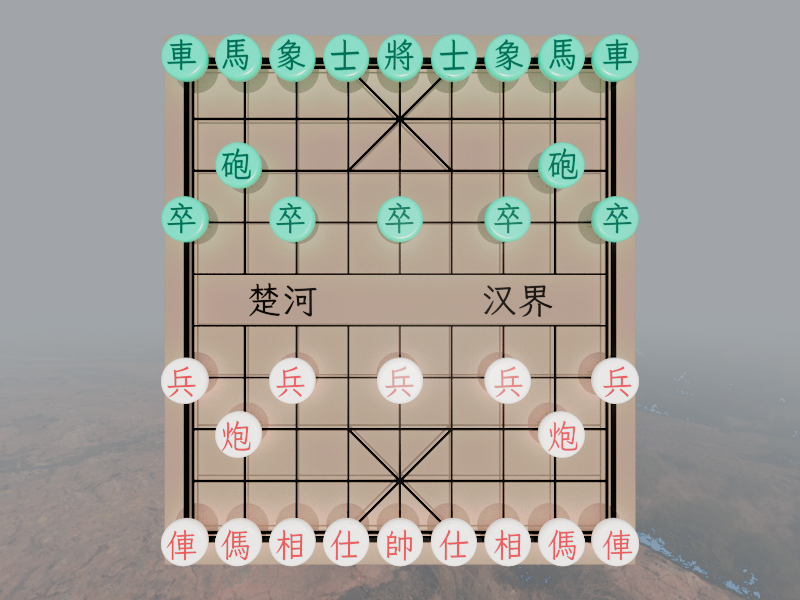

# Chinese Chess · 中国象棋

<div align="center">

**基于 C++23 和 Vulkan 1.4 的实时 3D 中国象棋渲染引擎**

支持光栅化 / RT Pipeline / Ray Query 三种渲染模式 | 内置路径追踪器 | ACES 2.0 色彩管理



</div>

---

## 目录

- [特性](#特性)
- [系统要求](#系统要求)
- [构建](#构建)
- [使用说明](#使用说明)
- [项目架构](#项目架构)
- [渲染技术](#渲染技术)
- [着色器说明](#着色器说明)
- [依赖项](#依赖项)
- [已知问题](#已知问题)
- [开发日志](#开发日志)
- [许可证](#许可证)

---

## 特性

### 🎮 核心功能

| 功能 | 说明 |
|------|------|
| **3D 棋盘与棋子** | 32 枚象棋棋子（16 红 + 16 黑），GLB 模型；棋盘文字"楚河汉界"与棋子文字由 FreeType 运行时栅格化（LXGW WenKai GB Medium） |
| **棋谱回放** | ICU4C 自动检测 GB2312/UTF-8 编码，正则解析中文记谱法（含前/中/后与中文数字），逐步播放对局（W/A 上一步，S/D 下一步） |
| **ImGui 控制面板** | 场景设置窗口包含相机、灯光、材质/物体、棋谱 4 个面板（docking + 多视口） |
| **截图保存** | 支持 EXR（HDR）和 PNG（LDR）格式，按 **C** 键保存当前帧（仅场景，不含 UI） |
| **热重载** | 按 **F5** 重编译当前激活渲染器的 pipeline（复用同一 pipeline cache 句柄，不读写盘）；按 **F6** 热重载磁盘纹理（SHA-256 判变 → 单线程重压缩 sidecar → 同槽位重上传） |
| **字体渲染** | FreeType 逐字栅格化生成字形图集，图集宽高 4 对齐、内容居中，经 UASTC 压缩为单通道 BC4（桌面）/ EAC_R11（移动端） |
| **RenderDoc 帧捕获** | Debug 构建集成 RenderDoc（v1.7.0 API）：UI 操作使场景变脏后，本帧自动开始/结束捕获 |

### 🎨 渲染特性

| 功能 | 说明 |
|------|------|
| **三种渲染模式** | 前向光栅化（MSAA 多重采样 + resolve）、Vulkan 光线追踪路径追踪（RT Pipeline）、compute + ray query 路径（Ray Query，与 RT pipeline 行为一致），UI 下拉一键切换 |
| **路径追踪器** | 最大 8 次弹射；NEE 多光源直接光照（Lambertian 漫反射 + GGX Cook-Torrance 镜面反射）；间接弹射波瓣选择（透射/GGX/漫反射） |
| **俄罗斯轮盘赌** | 基于路径吞吐量自适应终止（p_continue < 0.05 截断） |
| **时域累积** | 渐进式渲染，混合系数 `alpha = 1/(1 + frame_index/2)`，Wang Hash 种子按帧变化 + 子像素随机抖动抗锯齿 |
| **三种光源类型** | 方向光、点光源（距离平方衰减 + Range 裁剪）、聚光灯（内外锥角平滑过渡） |
| **阴影光线** | Any-Hit Shader + `ACCEPT_FIRST_HIT_AND_END_SEARCH` + `SKIP_CLOSEST_HIT` + 背面剔除 |
| **HDR 环境贴图** | 等距矩形投影 HDR 天空（默认 `cracked ground.hdr`，运行时压缩为 `.ktx2` sidecar）；未绑定贴图时回退默认天空色 |
| **ACES 2.0 色彩管理** | OpenColorIO：CPU 截图色彩变换 + GPU 合成 Pass 运行时注入（存在绑定序缺陷，见[已知问题](#已知问题)） |

**Bindless 描述符**：场景纹理通过单个大型描述符数组访问（最多 1024 个 `eCombinedImageSampler`，光栅 binding 2 / 光追 binding 5）。模型/材质/光源数据通过 SSBO 在 GPU 端直接索引。描述符仅在 scene_manager 聚合到 `any_dirty || is_render_dirty`（manager 实际重传 SSBO/重建 TLAS，或 resize/渲染器切换强制置位）时重建。

### ⚙️ 工程特性

| 功能 | 说明 |
|------|------|
| **现代 C++23** | 大量使用 `std::ranges`、`std::views::cartesian_product`、Concepts 约束、`std::format`/`std::println`、`std::move_only_function` |
| **Vulkan RAII 封装** | 使用 `vulkan.hpp` C++ 绑定（`vulkan_raii`）和 VMA (Vulkan Memory Allocator) RAII 接口 |
| **时间线信号量** | 单一时间线信号量 + 原子计数器的无栅栏 GPU-CPU 同步（组件各自持有独立的信号量与回收站） |
| **回收站机制** | 延迟资源销毁，按 GPU 信号量值安全释放资源（Debug 回收日志由 `output=false` 常量经 `if constexpr` 编译期关闭） |
| **资源状态追踪** | 每个 `vulkan_buffer`/`vulkan_image` 跟踪当前 Stage / Access / Layout / Queue，自动生成正确的 Pipeline Barrier |
| **智能队列选择** | C++23 `cartesian_product` 穷举（图形、计算、传输、呈现）队列族组合，专用传输队列 10× 加分，最大化独立队列族数量 |
| **两步初始化** | `vulkan_application` 分离 Instance 创建（`init`）与 Device/Swapchain 创建（`create`） |
| **管理器架构** | scene_model_manager 统一持有顶点/索引缓冲、BLAS/TLAS、间接绘制命令与模型 SSBO；各 manager 自查单一 is_dirty（create 与真删除时置脏、update 消费并返回是否执行），scene_manager 聚合 `any_dirty || is_render_dirty` 决定重建描述符或仅重置累积 |
| **KTX2 纹理压缩管线** | 磁盘纹理与字体图集统一 **UASTC 中间格式**（内存压缩 → 转码前同步写 sidecar → 加载时按设备转码 BC6H/BC7/BC4/EAC_R11 上传，设备不支持则回退 OIIO 直传） |
| **Pipeline 缓存** | 独立 RAII 类 `vulkan_pipeline_cache`（`vulkan_application` 单实例持有，所有管线共享同一句柄）：启动读盘一次（设备校验，不匹配/损坏则空缓存起步）、退出写盘一次，加速启动；F5 热重载不读写盘 |
| **工具单例** | shader_compiler / file_watcher / renderdoc_capture 为单例；其余工具为命名空间函数 |

---

## 系统要求

| 组件 | 最低要求 |
|------|----------|
| **操作系统** | Windows 10/11 x64 |
| **GPU** | 支持 Vulkan 1.4，具备硬件光线追踪（VK_KHR_ray_tracing_pipeline） |
| **显存** | 4 GB+（建议） |
| **内存** | 8 GB+（建议） |
| **编译器** | Visual Studio 2022 (v143+ toolchain) |
| **构建工具** | CMake（项目要求 ≥ 4.0）+ Ninja + vcpkg (manifest mode) |

### 必需 GPU 特性

扩展（`vulkan_application.cpp` 中枚举）：

```
VK_KHR_swapchain, VK_KHR_synchronization2
VK_KHR_acceleration_structure, VK_KHR_ray_tracing_pipeline, VK_KHR_ray_query
VK_KHR_deferred_host_operations, VK_KHR_buffer_device_address, VK_KHR_push_descriptor
```

特性（Features2 链）：`samplerAnisotropy`、`fillModeNonSolid`、`multiDrawIndirect`、`shaderInt64`、`pushDescriptor`（1.4）、`dynamicRendering`/`synchronization2`/`shaderIntegerDotProduct`（1.3）、`bufferDeviceAddress`/`runtimeDescriptorArray`/`scalarBlockLayout`/`timelineSemaphore`（1.2）、`shaderDrawParameters`（1.1）、`extendedDynamicState`（EXT）、加速度结构（`accelerationStructure` + CaptureReplay + UpdateAfterBind）、光线追踪（`rayTracingPipeline` + TraceRaysIndirect + PrimitiveCulling）。

---

## 构建

### 1. 初始化依赖

```bash
# 项目内置 vcpkg 子模块（见 .gitmodules）
git submodule update --init --recursive
.\vcpkg\bootstrap-vcpkg.bat   # 首次使用 vcpkg 时引导
```

vcpkg 使用 manifest 模式（`vcpkg.json`），工具链由 `CMakeLists.txt` 指向本地 `vcpkg/scripts/buildsystems/vcpkg.cmake`；`vcpkg-configuration.json` 的默认注册表为 GitHub `microsoft/vcpkg`（国内网络可自行替换为镜像）。

### 2. 配置与构建

```bash
cmake --preset x64-debug     # 或 x64-release
cmake --build out/build/x64-release
```

Visual Studio 2022：打开项目文件夹后，在 CMakePresets 中选择 **x64-debug** / **x64-release** 生成即可。
当前 `CMakePresets.json` 只定义了 configurePresets（无 buildPresets），并附带 x86 与 Linux/macOS 预设，但仅 **Windows x64** 经过测试维护。

### 3. 运行

```bash
# 注意：资源使用相对路径，工作目录必须为 chinese-chess/
.\out\build\x64-release\chinese-chess.exe
```

CMake 已通过 `DEBUGGER_WORKING_DIRECTORY` 将调试工作目录设为 `chinese-chess/`。

### 编译选项（来自 CMakeLists.txt）

```
C++23（target_compile_features cxx_std_23）
NOMINMAX / UNICODE / _UNICODE
VK_USE_PLATFORM_WIN32_KHR
GLFW_INCLUDE_VULKAN
GLM_FORCE_RADIANS / GLM_ENABLE_EXPERIMENTAL / GLM_FORCE_DEPTH_ZERO_TO_ONE
```

> 注意：源文件为无 BOM 的 UTF-8（含中文注释与字面量），`CMakeLists.txt` 已在 `if(WIN32)` 下通过 `add_compile_options(/utf-8)` 显式设置，非 UTF-8 系统区域下构建无需额外补充。

---

## 使用说明

### 基本操作

| 按键 | 功能 |
|------|------|
| **W/A** | 棋谱上一步 |
| **S/D** | 棋谱下一步 |
| **C** | 保存当前帧截图 |
| **F5** | 热重载：重新编译当前激活渲染器的 pipeline（若编译失败会直接终止程序，见[已知问题](#已知问题)） |
| **F6** | 热重载：检测已加载磁盘纹理的源文件，变更则单线程重压缩 KTX2 sidecar 并同槽位重上传 |
| **ImGui 面板** | 场景设置窗口控制相机、灯光、材质/物体、棋谱参数（相机无鼠标轨道控制，通过面板数值调整） |

### 渲染模式切换

在 UI 面板的"场景设置"中勾选"使用光线追踪"：
- **光栅化模式**：前向渲染 + MSAA，实时帧率
- **光线追踪模式**：路径追踪 + 时域累积，渐进式收敛（场景变化后自动重置累积）

### RenderDoc 帧捕获（Debug 构建）

Debug 构建会自动集成 RenderDoc：
1. 确保系统已安装 RenderDoc（`renderdoc.dll` 在进程 DLL 搜索路径中）
2. 在 UI 中进行任意操作（修改材质、移动光源等）使场景数据变脏
3. 程序在**本帧**自动开始并结束捕获（跳过首帧；`StartFrameCapture` 在 `scene->update()` 前调用，因此其中的上传/TLAS 构建也在捕获内）
4. 捕获文件保存在 `resources/captures/`（`_capture_N.rdc`）

### 棋谱回放

1. 将棋谱文件（.txt，中文记谱法）放入 `resources/records/` 目录
2. 在 UI 面板的"棋局管理"中点击"加载棋谱"选择棋谱文件（支持 GB2312/UTF-8，ICU 自动检测编码）
3. 使用播放控制逐步查看对局（W/A 上一步，S/D 下一步）

支持的记谱格式示例（每回合红黑交替）：

```
炮二平五，马8进7
马二进三，车9平8
...
```

### 截图

按 **C** 键保存当前帧。根据渲染格式自动选择保存格式：
- 16 位浮点格式 → `.exr` (HDR)
- 8 位整数格式 → `.png` (LDR)

保存时先经 CPU 端 OCIO 色彩变换（SceneLinear → 默认 display/view），截图保存在 `resources/captures/` 目录下。

---

## 项目架构

```
chinese-chess/
├── window/                           # GLFW 窗口 + 程序入口
│   ├── window.h/cpp                  # 窗口 RAII 封装、帧循环、输入分发、截图、RenderDoc 集成（Debug）
│   └── main.cpp                      # 程序入口
├── vulkan_core/      (17 个类)      # Vulkan 1.4 RAII 封装层
│   ├── vulkan_application           # 两步初始化（init→create）、场景+UI 合成渲染、持有 pipeline cache
│   ├── vulkan_common                # 格式选择、缓冲/图像上传/下载（QFOT）、运行期全局
│   ├── vulkan_device                # 逻辑设备 RAII 封装（move-only）
│   ├── vulkan_physical_device       # 物理设备选择：cartesian_product 队列分配
│   ├── vulkan_swapchain             # 交换链管理（Mailbox/FIFO、动态重建、逐图像二元信号量）
│   ├── vulkan_pipeline              # 管线创建（图形 + 光线追踪两个重载；缓存句柄由参数传入）
│   ├── vulkan_pipeline_cache        # 磁盘 pipeline cache 加载/保存（独立 RAII 类 + 设备校验）
│   ├── vulkan_descriptor            # 描述符池/集管理（variant 缓冲/图像写入）
│   ├── vulkan_buffer / vulkan_image # 缓冲/图像 + VMA RAII 分配器 + 状态追踪
│   ├── vulkan_commandbuffer         # 命令缓冲 + 时间线信号量集成（静态工厂批量创建）
│   ├── vulkan_queue                 # 队列 + CommandPool 封装
│   ├── vulkan_semaphore             # 时间线信号量 + 原子计数器
│   ├── vulkan_recycle_bin           # 延迟资源回收站（Debug 回收日志编译期关闭）
│   ├── vulkan_sampler               # 采样器 RAII（diffuse/font/sky_box/screen 等分类型）
│   ├── vulkan_acceleration_structure # BLAS/TLAS 创建（返回需保持存活的暂存缓冲）
│   └── vulkan_shader_binding_table  # 光线追踪 SBT 管理（5 个 Shader Group）
├── scene/            (11 个类)      # 场景管理
│   ├── scene_manager                # 场景编排器：双管线管理、脏检查、F5/F6 热重载、save_image
│   ├── scene_base                   # pro::proxy facade 定义（manager_base / manager_render）
│   ├── scene_model                  # 模型（BLAS 实例、变换矩阵、is_show 可见性、材质引用）
│   ├── scene_material               # PBR 材质（双色混合 + 粗糙度/金属度 + Alpha 贴图 + 透射参数）
│   ├── scene_light                  # 光源（扁平结构体，light_type 区分方向光/点光源/聚光灯）
│   ├── scene_camera                 # 透视/正交相机 + 缓存逆矩阵
│   ├── scene_model_manager          # 顶点/索引缓冲、BLAS/TLAS、间接绘制命令、模型 SSBO
│   ├── scene_material_manager       # 材质生命周期 + 材质 SSBO + bindless 纹理数组（KTX2 压缩、字体图集、F6 热重载）
│   ├── scene_light_manager          # 灯光生命周期 + 灯光 SSBO
│   ├── scene_rasterization_render   # 前向 MSAA 渲染：间接绘制、动态渲染、is_show 支持
│   ├── scene_raytracing_render      # 路径追踪：TLAS 引用、push constant 累积参数
│   └── scene_rayquery_render        # 路线 A 实验：compute + ray query 路径追踪（手动最近命中，9 实验模式）
├── ui/               (6 个类)       # ImGui 用户界面
│   ├── ui_manager                   # ImGui 初始化、MSAA 渲染、渲染模式切换
│   ├── ui_base                      # proxy.hpp facade 类型（多态 UI 面板）
│   ├── ui_camera                    # 相机编辑面板（投影类型/FOV/位置/方向/上下方向）
│   ├── ui_light                     # 灯光编辑面板（添加/删除/颜色/强度/锥角）
│   ├── ui_node                      # 材质 + 物体管理面板（含贴图/模型文件选择）
│   └── ui_record                    # 棋谱加载与逐步回放（ICU4C 正则解析，WASD 键导航）
├── tools/            (9 个模块)     # 工具与加载器（3 个单例类 + 6 个命名空间函数集）
│   ├── shader_compiler              # Slang → SPIR-V 运行时编译（依赖感知着色器缓存 + SHA-256；std::expected 返回）
│   ├── model_loader                 # glTF/GLB 模型加载 (fastgltf)，std::expected<model_data, std::string>
│   ├── image_helper                 # 图像读写 PNG/EXR/HDR (OpenImageIO) + KTX2 压缩/读写（UASTC 中间格式）+ 通道合成
│   ├── ocio_helper                  # OpenColorIO：GPU shader 生成/替换编译、LUT+UBO 上传、CPU 变换
│   ├── font_loader                  # FreeType 字形栅格化（逐字符 glyph 信息）
│   ├── record_loader                # 中文象棋记谱法解析（ICU4C 正则 + 走法规则 + 吃子处理）
│   ├── file_watcher                 # 文件变更检测（SHA-256 哈希比对，持久化缓存）
│   ├── string_helper                # 编码检测与转换（ICU4C）
│   └── renderdoc_capture            # RenderDoc API 封装（v1.7.0，Debug 构建专用）
└── resources/
    ├── shaders/      (10 个 .slang) # Slang 着色器源文件（编译缓存见 cache/）
    ├── fonts/        (磁盘 14 / 跟踪 2)  # 仅 LXGW WenKai GB Medium 被跟踪并用于运行时图集（其余 gitignored）
    ├── models/       (4 个 .glb)    # 棋盘、棋盘线、棋子、天空盒 + chess_all.blend 源文件
    ├── textures/     (.hdr + .ktx2) # HDR 环境贴图（cracked ground.hdr，约 90 MB；运行时生成 UASTC sidecar）
    ├── ocios/        (5 个 .ocio)   # ACES 2.0 色彩配置（studio/D60/reference/CG）+ 转换图
    ├── records/      (.txt)         # 棋谱文件（棋谱1.txt，GB2312 示例）
    ├── captures/     (.png/.exr/.rdc)  # 截图输出 + RenderDoc 捕获
    └── cache/        (pipeline_cache.cache + shader_cache.cache + hash_cache.cache)  # 运行期生成的缓存（gitignored）
```

### 数据流

帧循环（`glfw_window::render`）：`glfwPollEvents()` → `ui->update()`（ImGui 面板，UI 操作使场景置脏；Debug 下按需本帧 RenderDoc 捕获）→ `scene->update()`（脏检查：重传模型/材质/灯光 SSBO、重建 TLAS + 间接绘制命令 + 描述符）→ `ui->render()` / `scene->render()`（各自 MSAA/光追渲染后 submit，返回时间线信号量）→ `app->render()`（回收站 release → acquire swapchain → barrier → 全屏三角形混合 scene + UI（OCIO 注入代码作用于 scene 颜色）→ present）→ 需要时 `scene->save_image()`（`download_image` 三段式 QFOT → CPU OCIO 变换 → EXR/PNG）。详细时序见 `CLAUDE.md` Data Flow 一节。

### 核心设计模式

- **两步初始化**：`vulkan_application` 先 `init(instance_layers, extensions)` 创建 Instance，再 `create(surface, w, h)` 创建 Device/Swapchain/管线——两步之间可创建依赖 Instance 的 Window Surface。
- **智能队列选择**：`cartesian_product` 穷举（图形、计算、传输、呈现）队列族组合评分选择，专用传输队列 10× 加分。
- **时间线信号量 + 回收站**：`vulkan_semaphore`（时间线信号量 + 原子计数器）+ `vulkan_recycle_bin`（资源与信号量值配对，GPU 越过该值后销毁）；CB 在 submit 时 signal、begin_record 时 wait，帧循环无 Fence/`vkDeviceWaitIdle`（仅销毁/resize 调用）。
- **资源状态追踪**：`vulkan_buffer`/`vulkan_image` 在每次 barrier 后更新 Stage/Access/Layout/Queue，后续 barrier 基于实际当前状态生成。
- **Bindless 描述符**：纹理走大型描述符数组（≤1024），数据走 SSBO；仅在 `any_dirty || is_render_dirty` 时重建描述符。
- **UI/场景分层合成**：Blend Pass（`blend_image.slang`）全屏三角形 Alpha 混合两渲染输出；`ocio_conversion()` 函数体编译期被 OCIO 生成代码替换。
- **类型擦除 UI 面板**：`ui_base` 基于 `pro::proxy`（P0779R0 风格）值语义多态，`ui_manager` 以 `std::vector<pro::proxy<ui_base>>` 持有四个面板。
- **Debug/Release 一致帧序**：均为 `ui->update()` → `scene->update()`；Debug 额外在两者之间打开 RenderDoc 捕获（跳过首帧）。

---

## 渲染技术

### 光栅化管线 (`rasterization.slang`)

- 前向渲染，单次 `drawIndexedIndirect` 调用（命令由 scene_model_manager 生成）
- MSAA 多重采样 + resolve（从硬件支持的采样数中自动选择最高值）
- 深度测试 + 背面剔除；顶点数据 Position + UV
- Bindless 纹理数组，通过 `SV_DrawIndex` 索引模型/材质 SSBO
- 隐藏模型通过 `instanceCount=0` 跳过；fragment 同时守卫 `material_index` 与 `texture_index`（0xFFFFFFFF 判空）
- 双色混合：`lerp(background_color, foreground_color, alpha_map.r)`（非光照模型）

### 光线追踪管线 (`ray_tracing.slang` + `lighting.slang`)

蒙特卡洛路径追踪器（当前实现）：

- **NEE**：每个命中点对所有光源采样（方向光/点光源/聚光灯均为 delta 分布），阴影光线带背面剔除（半透明按 `opacity` 概率穿透），贡献按 MIS 幂启发式加权；diffuse `(1-kS)(1-metallic)albedo/π` + GGX Cook-Torrance specular；单光贡献 firefly 钳制
- **恒定环境光**：`AMBIENT_LIGHT`（默认 0.25）以 `材质色 × AMBIENT_LIGHT × (0.5 + 0.5·NdotV)` 叠加，完全阴影区域也有基础可见度
- **间接弹射（波瓣选择）**：按概率三分支——透射（`opacity × transmission`，玉石折射 + Beer-Lambert 吸收）、GGX 镜面（VNDF 重要性采样）、Disney 漫反射；吞吐量按 `lobe_value / (lobe_prob × p_continue)` 加权，`MAX_THROUGHPUT = 10`
- **高度雾**：解析指数雾（`evaluate_height_fog`），命中点弹射段与 miss 无穷远处均应用，含太阳散射
- **俄罗斯轮盘赌 / 最大弹射**：`p_continue = min(1, 亮度(throughput))`，低于 0.05 截断；`MAX_BOUNCES = 8`
- **时域累积**：`alpha = 1/(1 + frame_index/2)`，Wang Hash 种子按帧变化 + 子像素抖动；新采样亮度超已累积均值 4 倍时 firefly 钳制
- **天空**：`skybox_index` 有效时采样 HDR 等距矩形纹理，过暗回退程序化渐变天空
- **玉石棋子**：红方白玉 `(0.95, 0.92, 0.85)` + 深红刻字，黑方青玉 `(0.15, 0.45, 0.32)` + 墨绿刻字；`opacity=0.8, ior=1.5, transmission=1.0, roughness=0.3`，材质面板可调

### 其他着色器

- **`blend_image.slang`**（使用中）：场景 + UI Alpha 合成；`ocio_conversion()` 为占位实现，编译期由 `ocio_helper::replace_and_compile` 替换为 OCIO 生成代码（`USE_OCIO = true` 时）
- **`scene_skybox.slang` / `scene_brdflut.slang` / `scene_cubemap.slang`**（遗留）：HDR 立方体贴图色调映射、BRDF split-sum LUT、等距矩形→cubemap 转换；当前 C++ 未引用

### 色彩管理管线

1. 场景渲染 → `R16G16B16A16_SFLOAT` HDR 图像
2. 截图保存时 CPU 端执行 OCIO 色彩空间变换（SceneLinear → 默认 display/view）
3. GPU 合成 Pass：`generate_shader_info` + `replace_and_compile` 注入 OCIO 代码，上传 LUT 纹理与 UBO
4. 交换链使用 `eB8G8R8A8Unorm`（`USE_OCIO=true`）+ sRGB color space，present 模式优先 Mailbox，回退 FIFO
5. ⚠️ 已知缺陷：描述符写入顺序与管线布局不一致（UBO/纹理错位），GPU 端变换实际未正确生效，见[已知问题](#已知问题)

---

## 着色器说明

| 着色器 | 管线 | 入口点 | 状态 / 功能 |
|--------|------|--------|------|
| `rasterization.slang` | Graphics | `vertMain`, `fragMain` | 使用中：前向 MSAA，Bindless 纹理，间接绘制 |
| `ray_tracing.slang` | RT | `rayGenMain`, `rayClosestHitMain`, `rayMissMain`, `rayShadowMissMain`, `rayShadowAnyHitMain` | 使用中：路径追踪（NEE + MIS、GGX（VNDF 采样）/Disney 波瓣选择、玉石透射、高度雾、环境光、轮盘赌、时域累积（firefly 钳制仅累积帧生效）、HDR 天空） |
| `ray_query.slang` | Compute | `rayQueryComputeMain` | 使用中：compute + ray query 路径追踪（与 RT pipeline 行为一致：NEE/间接弹射/高度雾/时域累积；手动最近命中规避 Slang 2026.7.1 兼容问题，SPIR-V 1.6 整数点积种子） |
| `lighting.slang` | (module) | — | 使用中：光源采样、BRDF（含 GGX VNDF 重要性采样）、阴影光线、天空采样、高度雾 |
| `common.slang` | (module) | — | 使用中：常量、Wang Hash RNG、数学/颜色工具、Hammersley、全屏三角形 |
| `scene_data.slang` | (module) | — | 使用中：Vertex / model_data / material_data / light_data / push constant 结构（与 C++ 对齐） |
| `blend_image.slang` | Graphics | `vertMain`, `fragMain` | 使用中：场景+UI Alpha 合成；`ocio_conversion()` 编译期被 OCIO 代码替换 |
| `scene_skybox.slang` | Graphics | `vertMain`, `fragMain` | 遗留：HDR 立方体贴图 + Uncharted 2 色调映射（未被引用） |
| `scene_brdflut.slang` | Graphics | `vertMain`, `fragMain` | 遗留：BRDF 积分 LUT（Hammersley + GGX 重要性采样，未被引用） |
| `scene_cubemap.slang` | Graphics | `vertMain`, `fragMain` | 遗留：等距矩形→6 面立方体贴图（MRT，未被引用） |

着色器依赖关系：
```
common.slang ← scene_data.slang ← lighting.slang ← ray_tracing.slang
rasterization.slang 使用 common / scene_data 模块
ray_query.slang 使用 common / scene_data / lighting 模块
blend_image.slang 自包含（无 import；ocio_conversion 桩函数体由 ocio_helper 替换）
scene_skybox / scene_brdflut / scene_cubemap 为遗留模块（复用 common）
```

着色器使用 **Slang** 编译为 SPIR-V（`spirv_1_6` target，最大优化级别；compute 阶段 RayQuery 需在 shader_compiler 构造函数显式声明 `spvRayQueryKHR` 能力），运行时编译并缓存于 `resources/cache/shader_cache.cache` 单一序列化文件（依赖路径与指纹共用同一分隔符；依赖列表含入口 shader 自身：逐个重算 SHA-256 与缓存指纹比对，任一变化即重编译；命中时直接返回缓存、跳过 Slang 依赖分析）。入口点名称定义在 `tools/shader_compiler.h` 中。

---

## 依赖项

| 依赖 | 用途 |
|------|------|
| **glfw3** | 窗口创建与输入管理 |
| **glm** | 数学库（矩阵/向量运算） |
| **vulkan-headers** + **vulkan-utility-libraries** | Vulkan API |
| **vulkan-memory-allocator-hpp** | GPU 内存分配器 (VMA C++ RAII, 固定 3.3.0) |
| **imgui** 1.92.8 (docking-experimental + glfw/vulkan binding) | 用户界面（GLFW + Vulkan 后端，多视口支持） |
| **fastgltf** | glTF/GLB 模型加载 |
| **freetype** | 字体字形栅格化 |
| **opencolorio** | ACES 2.0 色彩管理（CPU 端变换 + GPU LUT/UBO 上传） |
| **yaml-cpp** | OpenColorIO 依赖（vcpkg 传递安装，CMake 中显式 find_package） |
| **openimageio** | 图像文件读写 (PNG/EXR/HDR) |
| **openssl** | 文件内容哈希 (SHA-256) |
| **proxy** | 多态值类型 facade 模式（UI 面板类型擦除） |
| **shader-slang** | Slang → SPIR-V 着色器编译 |
| **icu** (icu4c) | Unicode 字符集检测、编码转换、正则表达式 |
| **ktx**（vcpkg overlay port，KTX-Software 5.0.0-rc1，UASTC HDR） | BC6H/BC7 纹理压缩 + 加载 |

---

## 已知问题

完整清单与修复历史见 `CLAUDE.md` Known Issues 一节。当前影响使用的 OPEN 项：

- **F5 热重载编译错误会终止程序**（旧管线先回收再构造新管线，编译失败 → `std::terminate`）
- **OCIO GPU 合成变换未生效**（描述符绑定序错位，自 binding 3 起 UBO/纹理错位；CPU 截图色彩变换正常）
- **空容器写入空描述符**（`nullDescriptor` 未启用）：删光模型/材质/灯光后对应 SSBO 为空、空场景 TLAS 直接 retire，RT 描述符仍写（可能为 null 的）句柄；模型路径详见 `CLAUDE.md` #15
- **ImGui 多视口交换链验证误报**（第三方 imgui 1.92.8，辅助视口未 acquire 即 present）

---

## 开发日志

```text
2026-02  分离场景与 UI 渲染到各自图像并最后混合；清理无用函数
2026-03  添加天空盒；添加光线追踪所需扩展；修复验证层警告；重构 commandbuffer 封装；添加基础 OCIO 映射
2026-04  完善 OCIO 映射与小修正
2026-05  光线追踪封装（加速结构创建，移除 proxy 库）；光追初步实现；SSBO 重写光追；可按棋谱移动棋子；可切换光栅化/光追；替换为立体模型并尝试路径追踪
2026-06  重写提升可维护性；纠正矩阵乘法顺序；UI 与场景管理封装；多光源处理；灯光/摄像机 UI 封装；高光计算；物体与材质封装（proxy4 取代虚函数）；VMA 管理存储；HDR 天空采样；智能队列选择与独立命令池；时间线信号量取代栅栏并添加回收站
2026-07  物理设备/逻辑设备封装；彻底分离传输与图像队列（时间线信号量同步）；拆分单独的时间线信号量与回收站；特定条件触发 RenderDoc 抓帧；modelmanager 统一构建 TLAS 与间接绘制命令；尽量移除 u8string
2026-08  上旬 CMake 迁移（CMakeLists/CMakePresets 取代 .slnx/.vcxproj）+ vcpkg 子模块；scene_light 扁平结构体重构；着色器全量重写（common/scene_data 模块化、修复布局与 texture_index 守卫）；半透明玉石棋子；恒定环境光；std::expected 改造
2026-08  中旬 KTX2 压缩管线：磁盘纹理 UASTC sidecar（内存压缩 → 同步写盘 → 加载转码 BC6H/BC7）；字体图集压缩（BC4/EAC_R11，4 对齐居中）；F6 单线程热重载（SHA-256 门控 + 同槽位重上传）；字形 padding=2 修复渗墨；细粒度脏检查（各 manager 自查 is_dirty）+ TLAS 增量 refit；F5 仅重编译激活渲染器
2026-08  下旬 pipeline cache 定稿（独立 vulkan_pipeline_cache 单实例：启动读盘一次/退出写盘一次，F5 不读写盘；着色器编译并入 vulkan_pipeline；着色器缓存依赖感知——单一序列化文件 shader_cache.cache）；is_render_dirty 精细化重建（resize/切换零重传）；析构顺序加固（vulkan_application/scene_manager/ui_manager 析构前自行 wait，destroy() 合并进析构函数）；scene_base facade 优化（proxy_view 无需 support_*）；ui_base 约束收紧为 nothrow；修饰符规范扫描（补 7 处 [[nodiscard]]、移除 4 个错误 noexcept（vulkan_common）、[[nodiscard]] 只留 .h 声明）
2026-08-28  文档重扫修正：着色器缓存实为单一序列化文件 resources/cache/shader_cache.cache（非逐文件 .spv）；file_watcher 缓存实为 hash_cache.cache（非 file_watch_cache.cache）；Known Issue #3 引用改为 scene_manager.cpp:141-144 + 渲染器 recreate()；swapchain 两个 getter 的 noexcept 经复核确认按 getter 规则保留（作者决定以当前代码为准）；Known Issue #34 记录 ~vulkan_application 对未创建 device 无守卫调 waitIdle 的现状（作者决定暂不修改）；着色器缓存两级键优化（依赖列表逐文件校验，命中路径跳过 Slang loadModule，消除每次编译的依赖分析开销；缓存条目扁平化字符串字段、魔数不变，作者手动删除旧缓存文件；后移除冗余 entry_hash——Slang 依赖列表已含入口文件自身，指纹校验即覆盖入口变化；dependence/fingerprint 分隔符统一为单个 '\n'）
2026-08-29  文档复核修正（以代码为准）：Known Issue #5 修正——代码无 dummy SSBO，空场景 TLAS 直接 retire（scene_model_manager.cpp:247-251），模型/材质/灯光三路 SSBO 空容器均跳过创建，RT 描述符仍写可能为 null 的句柄；Known Issue #8 改判 FIXED——BLAS/TLAS 构建实际已用 compute 队列（scene_model_manager.cpp:217-223 / 258-262）；Known Issue #27 数值修正——模型缩放钳制实为 [0.001, 10000]（ui_node.cpp:240）。同日代码整理：容器下标硬化仅 `record_loader.cpp` 保留 `charAt()`（ICU UnicodeString 的 `operator[]` 与 `charAt` 同实现、零开销），`vulkan_physical_device.h` 的 `.at()` 因编译失败回退为 `[]`；include 按 IWYU 清理（移除 5 处未使用、补充约 28 处缺失，含头文件自包含性，顺序交 clang-format）；`file_watcher::is_file_modified()` 改 `const` + `mutable` 哈希缓存（与 shader_compiler 缓存模式对齐）
2026-08-31  光线追踪路线 A：新增 compute + ray query 路径追踪渲染器（`scene_rayquery_render` + `ray_query.slang`；`render_mode` 三模式枚举 + UI 下拉切换）。SPIR-V 1.6 全面升级：着色器 profile `spirv_1_6`、移除 `VK_KHR_spirv_1_4` 扩展、启用 `shaderIntegerDotProduct`、RNG 种子改用整数点积 OpUDot。Slang 2026.7.1 RayQuery 兼容问题（无候选确认 API / CommittedStatus 恒 None / CandidateInstanceID 错映射到自定义索引 / TraceRayInline 参数顺序）已逐一探测并规避（手动最近命中 + CandidateInstanceIndex），详见 `ray-tracing-extensions-plan.md` §12.6。后按作者要求移除 A2 实验模式与实验 UI，ray query 与 RT pipeline 行为对齐（时域累积/间接弹射/高度雾）
2026-09-01  常量/函数修饰符提升（C++23 编译期优先，先 constexpr/constinit 后 const）：`color_format`→`static constexpr`、`global_counter`→`constinit`、`move_piece`/`location_transform`→`constexpr`、`vulkan_recycle_bin.h` `output`→`constexpr`；流水线创建处 vk 结构字面量（`bindings`/`push_constant`/`pool_size`、RT `shader_groups` 改 `constexpr std::array`）提升；`scene_camera` 平凡 getter 移入头文件 `constexpr`（值类型）；GPU 包装类 getter 与 `owner_less` 局部 constexpr 经复核回退（空洞/噪音）。着色器优化与质量改进：GGX 间接弹射改真正 VNDF 重要性采样（Heitz 2018，pdf=D·G1(V)/(4·NdotV)、value=F·G1(L)，方差更低、无被拒采样）；firefly 钳制仅累积帧生效（修首帧/相机移动后陈旧均值压暗）；`lighting.slang` 死代码清理（~150 行）与重复求值消除（`sample_ggx_brdf` 内联 GGX 评估、Disney 复用 NdotL）；整数幂 pow 改乘法
```

---

## 许可证

本项目基于 **MIT License** 开源。详见 [LICENSE.txt](LICENSE.txt)。

使用的第三方资源：
- 字体：**LXGW WenKai GB / 霞鹜文楷 GB**（SIL Open Font License）
- 字体：**Source Han Sans SC / 思源黑体**（SIL Open Font License）
- 遗留着色器（scene_brdflut / scene_skybox）：**Sascha Willems Vulkan Examples**（MIT License）
- RenderDoc API 头文件：**RenderDoc**（MIT License, Copyright Baldur Karlsson）
