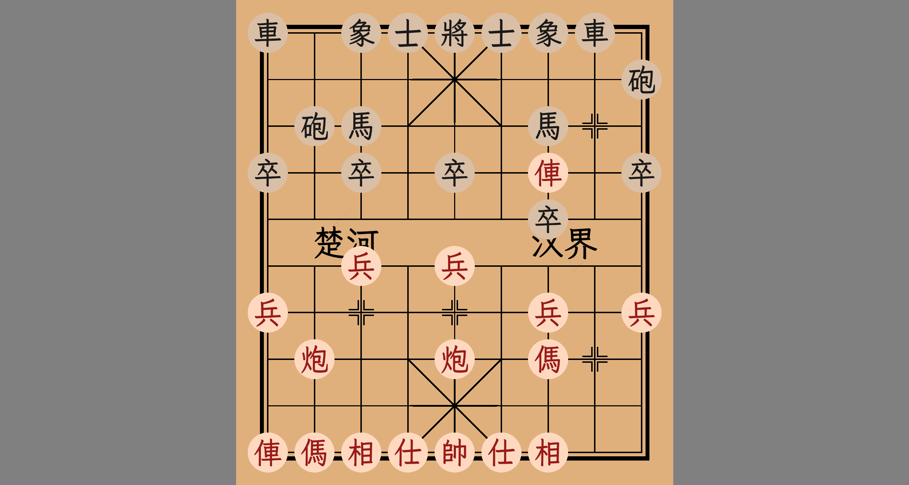

# Chinese Chess · 中国象棋

<div align="center">

**基于 C++23 和 Vulkan 1.4 的实时 3D 中国象棋渲染引擎**

支持光栅化与光线追踪双渲染模式 | 内置路径追踪器 | ACES 2.0 色彩管理



</div>

---

## 目录

- [特性](#特性)
- [系统要求](#系统要求)
- [构建](#构建)
- [使用说明](#使用说明)
- [项目架构](#项目架构)
- [渲染技术](#渲染技术)
- [着色器说明](#着色器说明)
- [依赖项](#依赖项)
- [已知问题](#已知问题)
- [开发日志](#开发日志)
- [许可证](#许可证)

---

## 特性

### 🎮 核心功能

| 功能 | 说明 |
|------|------|
| **3D 棋盘与棋子** | 32 枚象棋棋子（16 红 + 16 黑），GLB 模型；棋盘文字"楚河汉界"与棋子文字由 FreeType 运行时栅格化（LXGW WenKai GB Medium） |
| **棋谱回放** | ICU4C 自动检测 GB2312/UTF-8 编码，正则解析中文记谱法（含前/中/后与中文数字），逐步播放对局（W/A 上一步，S/D 下一步） |
| **ImGui 控制面板** | 场景设置窗口包含相机、灯光、材质/物体、棋谱 4 个面板（docking + 多视口） |
| **截图保存** | 支持 EXR（HDR）和 PNG（LDR）格式，按 **C** 键保存当前帧（仅场景，不含 UI） |
| **热重载** | 按 **F5** 重建当前渲染管线并重新编译着色器；file_watcher 以 SHA-256 哈希判定文件是否修改，未修改则直接使用 .spv 缓存 |
| **字体渲染** | FreeType 逐字栅格化生成字形图集；资源含 LXGW WenKai GB（3 字重）、LXGW WenKai Mono GB（3 字重）、思源黑体（7 字重）、华文粗楷 |
| **RenderDoc 帧捕获** | Debug 构建集成 RenderDoc（v1.7.0 API）：UI 操作使场景变脏后，下一帧自动开始/结束捕获 |

### 🎨 渲染特性

| 功能 | 说明 |
|------|------|
| **双渲染管线** | 前向光栅化（MSAA 多重采样 + resolve）与 Vulkan 光线追踪路径追踪，运行时一键切换 |
| **路径追踪器** | 最大 8 次弹射；NEE 多光源直接光照（Lambertian 漫反射 + GGX Cook-Torrance 镜面反射）；间接弹射为 Lambertian 余弦加权采样 |
| **俄罗斯轮盘赌** | 基于路径吞吐量最大分量自适应终止（p_continue < 0.05 直接截断） |
| **时域累积** | 渐进式渲染，混合系数 alpha = 1/(frame_index+1)，Wang Hash 种子按帧变化 + 子像素随机抖动抗锯齿 |
| **三种光源类型** | 方向光、点光源（距离平方衰减 + Range 裁剪）、聚光灯（内外锥角平滑过渡） |
| **阴影光线** | Any-Hit Shader + `RAY_FLAG_ACCEPT_FIRST_HIT_AND_END_SEARCH` + `SKIP_CLOSEST_HIT` + 背面剔除 |
| **HDR 环境贴图** | 等距矩形投影 HDR 天空（默认 `干裂地面.hdr`）；未绑定贴图时回退默认天空色 |
| **ACES 2.0 色彩管理** | OpenColorIO：CPU 截图色彩变换 + GPU 合成 Pass 运行时注入（存在绑定序缺陷，见[已知问题](#已知问题)） |
| **Bindless 描述符** | 最多 1024 个纹理的运行时描述符数组（两条渲染路径共用） |

### ⚙️ 工程特性

| 功能 | 说明 |
|------|------|
| **现代 C++23** | 大量使用 `std::ranges`、`std::views::cartesian_product`、Concepts 约束、`std::format`/`std::println`、`std::move_only_function` |
| **Vulkan RAII 封装** | 使用 `vulkan.hpp` C++ 绑定（`vulkan_raii`）和 VMA (Vulkan Memory Allocator) RAII 接口 |
| **时间线信号量** | 单一时间线信号量 + 原子计数器的无栅栏 GPU-CPU 同步（组件各自持有独立的信号量与回收站） |
| **回收站机制** | 延迟资源销毁，按 GPU 信号量值安全释放资源（Debug 构建打印回收日志） |
| **资源状态追踪** | 每个 `vulkan_buffer`/`vulkan_image` 跟踪当前 Stage / Access / Layout / Queue，用于自动生成正确的 Pipeline Barrier |
| **智能队列选择** | C++23 `cartesian_product` 穷举（图形、计算、传输、呈现）队列族组合，专用传输队列 10× 加分，最大化独立队列族数量 |
| **两步初始化** | `vulkan_application` 分离 Instance 创建（`init`）与 Device/Swapchain 创建（`create`） |
| **管理器架构** | scene_model_manager 统一持有顶点/索引缓冲、BLAS/TLAS、间接绘制命令与模型 SSBO；材质/灯光管理器持有各自 SSBO |
| **工具单例** | shader_compiler / file_watcher / renderdoc_capture 为单例；其余工具为命名空间函数 |

---

## 系统要求

| 组件 | 最低要求 |
|------|----------|
| **操作系统** | Windows 10/11 x64 |
| **GPU** | 支持 Vulkan 1.4，具备硬件光线追踪（VK_KHR_ray_tracing_pipeline） |
| **显存** | 4 GB+（建议） |
| **内存** | 8 GB+（建议） |
| **编译器** | Visual Studio 2022 (v143+ toolchain) |
| **构建工具** | CMake（项目要求 ≥ 4.0）+ Ninja + vcpkg (manifest mode) |

### 必需 GPU 特性

扩展（`vulkan_application.cpp` 中枚举）：

```
VK_KHR_swapchain, VK_KHR_spirv_1_4, VK_KHR_synchronization2
VK_KHR_acceleration_structure, VK_KHR_ray_tracing_pipeline
VK_KHR_deferred_host_operations, VK_KHR_buffer_device_address, VK_KHR_push_descriptor
```

特性（Features2 链）：

```
samplerAnisotropy, fillModeNonSolid, multiDrawIndirect, shaderInt64
pushDescriptor (Vulkan 1.4), dynamicRendering (1.3), synchronization2 (1.3)
bufferDeviceAddress (1.2), runtimeDescriptorArray (1.2), scalarBlockLayout (1.2), timelineSemaphore (1.2)
shaderDrawParameters (1.1), extendedDynamicState (VK_EXT_extended_dynamic_state)
accelerationStructure + accelerationStructureCaptureReplay + descriptorBindingAccelerationStructureUpdateAfterBind
rayTracingPipeline + rayTracingPipelineTraceRaysIndirect + rayTraversalPrimitiveCulling
```

---

## 构建

### 1. 初始化依赖

```bash
# 项目内置 vcpkg 子模块（见 .gitmodules）
git submodule update --init --recursive

# 首次使用 vcpkg 时引导
.\vcpkg\bootstrap-vcpkg.bat
```

vcpkg 使用 manifest 模式（`vcpkg.json`），工具链由 `CMakeLists.txt` 指向本地 `vcpkg/scripts/buildsystems/vcpkg.cmake`。
`vcpkg-configuration.json` 的默认注册表为 GitHub `microsoft/vcpkg`（国内网络可自行替换为镜像）。

### 2. 配置与构建

```bash
# 使用 VS2022 开发者命令行（或直接用 VS 打开项目文件夹）
cmake --preset x64-debug     # 或 x64-release
cmake --build out/build/x64-release
```

Visual Studio 2022：打开项目文件夹后，在 CMakePresets 中选择 **x64-debug** / **x64-release** 生成即可。
当前 `CMakePresets.json` 只定义了 configurePresets（无 buildPresets），并附带 x86 与 Linux/macOS 预设，但仅 **Windows x64** 经过测试维护。

### 3. 运行

```bash
# 注意：资源使用相对路径，工作目录必须为 chinese-chess/
.\out\build\x64-release\chinese-chess.exe
```

CMake 已通过 `DEBUGGER_WORKING_DIRECTORY` 将调试工作目录设为 `chinese-chess/`。

### 编译选项（来自 CMakeLists.txt）

```
C++23（target_compile_features cxx_std_23）
NOMINMAX / UNICODE / _UNICODE
VK_USE_PLATFORM_WIN32_KHR
GLFW_INCLUDE_VULKAN
GLM_FORCE_RADIANS / GLM_ENABLE_EXPERIMENTAL / GLM_FORCE_DEPTH_ZERO_TO_ONE
```

> 注意：源文件为无 BOM 的 UTF-8（含中文注释与字面量），而当前 `CMakeLists.txt` 未显式添加 `/utf-8`。在非 UTF-8 系统区域下构建请补充 `target_compile_options(chinese-chess PRIVATE /utf-8)`（旧的 .vcxproj 与现有 out/build 构建脚本中均包含 `/utf-8 /W4 /permissive-`）。

---

## 使用说明

### 基本操作

| 按键 | 功能 |
|------|------|
| **W/A** | 棋谱上一步 |
| **S/D** | 棋谱下一步 |
| **C** | 保存当前帧截图 |
| **F5** | 热重载：重新编译着色器并重建当前渲染管线（若着色器编译失败会直接终止程序，见[已知问题](#已知问题)） |
| **ImGui 面板** | 场景设置窗口控制相机、灯光、材质/物体、棋谱参数（相机无鼠标轨道控制，通过面板数值调整） |

### 渲染模式切换

在 UI 面板的"场景设置"中勾选"使用光线追踪"：
- **光栅化模式**：前向渲染 + MSAA，实时帧率
- **光线追踪模式**：路径追踪 + 时域累积，渐进式收敛（场景变化后自动重置累积）

### RenderDoc 帧捕获（Debug 构建）

Debug 构建会自动集成 RenderDoc：
1. 确保系统已安装 RenderDoc（`renderdoc.dll` 在进程 DLL 搜索路径中）
2. 在 UI 中进行任意操作（修改材质、移动光源等）使场景数据变脏
3. 程序在**下一帧**自动开始并结束 RenderDoc 捕获
4. 捕获文件保存在 `resources/captures/`（`_capture_N.rdc`）

### 棋谱回放

1. 将棋谱文件（.txt，中文记谱法）放入 `resources/records/` 目录
2. 在 UI 面板的"棋局管理"中点击"加载棋谱"选择棋谱文件（支持 GB2312/UTF-8，ICU 自动检测编码）
3. 使用播放控制逐步查看对局（W/A 上一步，S/D 下一步）

支持的记谱格式示例（每回合红黑交替）：

```
炮二平五，马8进7
马二进三，车9平8
...
```

### 截图

按 **C** 键保存当前帧。根据渲染格式自动选择保存格式：
- 16 位浮点格式 → `.exr` (HDR)
- 8 位整数格式 → `.png` (LDR)

保存时先经 CPU 端 OCIO 色彩变换（SceneLinear → 默认 display/view），截图保存在 `resources/captures/` 目录下。

---

## 项目架构

```
chinese-chess/
├── window/                           # GLFW 窗口 + 程序入口
│   ├── window.h/cpp                  # 窗口 RAII 封装、帧循环、输入分发、截图、RenderDoc 集成（Debug）
│   └── main.cpp                      # 程序入口
├── vulkan_core/      (15 个类)      # Vulkan 1.4 RAII 封装层
│   ├── vulkan_application           # 核心应用：两步初始化（init→create）、场景+UI 合成渲染
│   ├── vulkan_common                # 共享工具：格式选择、缓冲/图像上传/下载（三段式 QFOT）
│   ├── vulkan_device                # 逻辑设备 RAII 封装（move-only）
│   ├── vulkan_physical_device       # 物理设备选择：C++23 cartesian_product 队列分配
│   ├── vulkan_swapchain             # 交换链管理（Mailbox/FIFO、动态重建、逐图像二元信号量）
│   ├── vulkan_pipeline              # 管线创建（图形 + 光线追踪两个重载）
│   ├── vulkan_descriptor            # 描述符池/集管理（variant 缓冲/图像写入）
│   ├── vulkan_buffer / vulkan_image # 缓冲/图像 + VMA RAII 分配器 + 状态追踪
│   ├── vulkan_commandbuffer         # 命令缓冲 + 时间线信号量集成（静态工厂批量创建）
│   ├── vulkan_queue                 # 队列 + CommandPool 封装
│   ├── vulkan_semaphore             # 时间线信号量 + 原子计数器
│   ├── vulkan_recycle_bin           # 延迟资源回收站（Debug 构建打印回收日志）
│   ├── vulkan_acceleration_structure # BLAS/TLAS 创建（返回需保持存活的暂存缓冲）
│   └── vulkan_shader_binding_table  # 光线追踪 SBT 管理（5 个 Shader Group）
├── scene/            (10 个类)      # 场景管理
│   ├── scene_manager                # 场景编排器：双管线管理、脏检查、F5 热重载、save_image
│   ├── scene_model                  # 模型（BLAS 实例、变换矩阵、is_show 可见性、材质引用）
│   ├── scene_material               # PBR 材质（双色混合 + 粗糙度 + 金属度 + Alpha 贴图 + 透射参数 opacity/ior/transmission）
│   ├── scene_light                  # 光源（扁平结构体，light_type 区分方向光/点光源/聚光灯）
│   ├── scene_camera                 # 透视/正交相机 + 缓存逆矩阵
│   ├── scene_model_manager          # 顶点/索引缓冲、BLAS/TLAS、间接绘制命令、模型 SSBO
│   ├── scene_material               # PBR 材质（双色混合 + 粗糙度 + 金属度 + Alpha 贴图 + 透射参数 opacity/ior/transmission）
│   ├── scene_light_manager          # 灯光生命周期 + 灯光 SSBO
│   ├── scene_rasterization_render   # 前向 MSAA 渲染：间接绘制、动态渲染、is_show 支持
│   └── scene_raytracing_render      # 路径追踪：TLAS 引用、push constant 累积参数
├── ui/               (6 个类)       # ImGui 用户界面
│   ├── ui_manager                   # ImGui 初始化、MSAA 渲染、渲染模式切换
│   ├── ui_base                      # proxy.hpp facade 类型（多态 UI 面板）
│   ├── ui_camera                    # 相机编辑面板（投影类型/FOV/位置/方向/上下方向）
│   ├── ui_light                     # 灯光编辑面板（添加/删除/颜色/强度/锥角）
│   ├── ui_node                      # 材质 + 物体管理面板（含贴图/模型文件选择）
│   └── ui_record                    # 棋谱加载与逐步回放（ICU4C 正则解析，WASD 键导航）
├── tools/            (9 个类)       # 工具与加载器
│   ├── shader_compiler              # Slang → SPIR-V 运行时编译（.spv 缓存 + SHA-256；std::expected 返回，失败带 Slang 诊断）
│   ├── model_loader                 # glTF/GLB 模型加载 (fastgltf)，std::expected<model_data, load_error>，consteval 顶点属性描述
│   ├── image_helper                 # 图像读写 PNG/EXR/HDR (OpenImageIO)
│   ├── ocio_helper                  # OpenColorIO：GPU shader 生成/替换编译、LUT+UBO 上传、CPU 变换
│   ├── font_loader                  # FreeType 字形栅格化（逐字符 glyph 信息）
│   ├── record_loader                # 中文象棋记谱法解析（ICU4C 正则 + 走法规则 + 吃子处理）
│   ├── file_watcher                 # 文件变更检测（SHA-256 哈希比对，持久化缓存）
│   ├── string_helper                # 编码检测与转换（ICU4C）
│   └── renderdoc_capture            # RenderDoc API 封装（v1.7.0，Debug 构建专用）
└── resources/
    ├── shaders/      (8 个 .slang)  # Slang 着色器源文件（含 .spv 编译缓存）
    ├── fonts/        (14 个字体)    # LXGW WenKai GB/Mono GB + 思源黑体 + 华文粗楷
    ├── models/       (4 个 .glb)    # 棋盘、棋盘线、棋子、天空盒 + chess_all.blend 源文件
    ├── textures/     (.hdr)         # HDR 环境贴图（干裂地面.hdr，约 90 MB）
    ├── ocios/        (5 个 .ocio)   # ACES 2.0 色彩配置（studio/D60/reference/CG）+ 转换图
    ├── records/      (.txt)         # 棋谱文件（棋谱1.txt，GB2312 示例）
    ├── captures/     (.png/.exr/.rdc)  # 截图输出 + RenderDoc 捕获
    └── file_watch_cache.hash        # 文件监听持久化哈希缓存
```

### 数据流

```
帧循环 (glfw_window::render):
  glfwPollEvents()

  [Debug 构建]:
    scene->update()          → 脏检查：上传模型/材质/灯光 SSBO，重建 TLAS + 间接绘制命令 + 描述符
    ui->update()             → ImGui NewFrame + 面板更新 + ImGui::Render
    need_capture = scene->get_need_update()  // UI 使场景变脏？下一帧开始 RenderDoc 捕获
  [Release 构建]:
    ui->update()             → 同帧更新（无 RenderDoc 捕获逻辑）
    scene->update()

  ui->render()               → UI MSAA 渲染 → resolve → submit（返回时间线信号量）
  scene->render()            → 光栅化或光追渲染 → submit（返回时间线信号量）
  app->render({ui, scene})   → 回收站 release
                             → 命令缓冲 begin_record（等待时间线信号量 + 清空列表）
                             → swapchain.acquire_image（OutOfDate 则 end_record + return）
                             → 添加等待：scene/UI 时间线 + acquire 二元信号量
                             → Pipeline Barrier: scene/UI → eShaderSampledRead
                             → Pipeline Barrier: swapchain → eColorAttachmentOptimal
                             → 全屏三角形混合绘制（采样 scene + UI 纹理；OCIO 注入代码作用于 scene 颜色）
                             → Pipeline Barrier: swapchain → ePresentSrcKHR
                             → end_record → submit（signal）→ present（Mailbox/FIFO）
                             → 推进 current_frame

  if need_save: scene->save_image() → download_image 三段式 QFOT → CPU OCIO 变换 → EXR/PNG
  [Debug: RenderDoc end_capture]

  FPS 计数器（窗口标题，每 0.5 秒更新）
```

### 核心设计模式

**两步初始化**：`vulkan_application` 使用 `init(instance_layers, extensions)` 创建 Vulkan Instance，再调用 `create(surface, width, height)` 创建 Device、Swapchain、管线。分离设计允许在两步之间创建 Window Surface（Surface 依赖 Instance）。

**智能队列选择**：`vulkan_physical_device::create()` 使用 C++23 `std::views::cartesian_product` 穷举所有（图形、计算、传输、呈现）队列族组合，评分选择最优方案——强烈偏好专用传输队列（10× 加分），最大化独立队列族数量。

**时间线信号量 + 回收站**：`vulkan_semaphore` 封装时间线信号量与原子 CPU 计数器。`vulkan_recycle_bin` 将资源与信号量值配对存储；`release()` 在 GPU 通过该值后销毁资源。命令缓冲在 submit 时 Signal，在 `begin_record()` 时 Wait。常规帧循环无需 Fence 与 `vkDeviceWaitIdle`（仅窗口销毁与 resize 回调调用 waitIdle）。

**资源状态追踪**：`vulkan_buffer`/`vulkan_image` 在每次 Pipeline Barrier 后通过 `set_info()` 更新当前 Stage / Access / Layout / Queue。后续 Barrier 基于实际当前状态生成，而非假设的状态。

**队列所有权转移（upload_image / download_image）**：上传为三段式——传输队列 release（仅转移所有权，不改变布局，纯传输队列无 shader 阶段）→ 图形队列 acquire 并转换到 `eShaderReadOnlyOptimal`。下载为五段式——图形 release → 传输队列转换到 `eTransferSrcOptimal` 并拷贝到 staging → 图形队列 re-acquire 并恢复原布局。

**Bindless 描述符**：场景纹理通过单个大型描述符数组访问（最多 1024 个 `eCombinedImageSampler`，光栅 binding 2 / 光追 binding 5）。模型/材质/光源数据通过 SSBO 在 GPU 端直接索引。

**UI/场景分层合成**：应用层的 Blend Pass（`blend_image.slang`）通过全屏三角形将场景渲染输出和 UI 渲染输出进行 Alpha 混合；`ocio_conversion()` 函数体在编译期被 OCIO 生成代码替换（`USE_OCIO=true`）。

**类型擦除 UI 面板**：`ui_base` 使用 `pro::proxy` 库（P0779R0 风格）实现值语义多态。`ui_manager` 以 `std::vector<pro::proxy<ui_base>>` 持有异构面板（ui_camera、ui_light、ui_node、ui_record），统一分发 resize/update/handle。

**Debug/Release 分离**：Debug 构建中帧循环拆分 UI 和 Scene 更新——Scene 先更新以检测变化，UI 在上一帧结果上更新，从而为 RenderDoc 提供准确的捕获时机。Release 构建中 UI 和 Scene 在同一帧更新，无 RenderDoc 开销。

---

## 渲染技术

### 光栅化管线 (`rasterization.slang`)

- 前向渲染，单次 `drawIndexedIndirect` 调用（命令由 scene_model_manager 生成）
- MSAA 多重采样 + resolve（从硬件支持的采样数中自动选择最高值）
- 深度测试 + 背面剔除
- 顶点数据：Position + UV（法线已注释，光栅化路径不需要法线）
- Bindless 纹理数组，通过 `SV_DrawIndex` 索引模型和材质 SSBO
- 隐藏模型通过 `instanceCount=0` 正确跳过
- 双色混合：`lerp(background_color, foreground_color, alpha_map.r)`（非光照模型）
- ⚠️ fragment 阶段未对 `texture_index` 做 0xFFFFFFFF 守卫（与光追路径不一致，见[已知问题](#已知问题)）

### 光线追踪管线 (`ray_tracing.slang` + `lighting.slang`)

蒙特卡洛路径追踪器（当前实现）：

- **NEE（Next Event Estimation）**：每个命中点对所有光源执行直接光照采样（方向光/点光源/聚光灯均为 delta 分布），阴影光线（Any-Hit + `ACCEPT_FIRST_HIT_AND_END_SEARCH | SKIP_CLOSEST_HIT | CULL_BACK_FACING_TRIANGLES`，半透明材质按 `opacity` 概率穿透），贡献按 MIS 幂启发式（`power_heuristic`）加权
- **直接光照 BRDF**：`diffuse = (1-kS)·(1-metallic)·albedo/π`（Lambertian）+ `specular = evaluate_ggx(...)`（Trowbridge-Reitz NDF + Smith 几何 + Fresnel-Schlick）；单光源贡献带 firefly 钳制 `min(亮度(throughput)×100, 100)`
- **恒定环境光**：`AMBIENT_LIGHT`（默认 0.25），直接光之后以 `材质色 × AMBIENT_LIGHT × (0.5 + 0.5·NdotV)` 叠加，完全阴影区域也有基础可见度
- **间接弹射（波瓣选择）**：按概率三分支——透射（`opacity × transmission`，玉石折射 + Beer-Lambert 吸收）、GGX 镜面（VNDF 重要性采样）、Disney 漫反射；吞吐量 `×= lobe_value / (lobe_prob × p_continue)`，`MAX_THROUGHPUT = 10` 钳制
  - 玉石透射：`absorption_density = JADE_BASE_ABSORPTION(12) + JADE_ENGRAVE_ABSORPTION(30) × texture_weight`，仅进入时衰减（`T = exp(-density × PIECE_THICKNESS)`）；`texture_weight`（字符 alpha 权重）随 `HitPayload` 透传，刻字区更暗更实
- **高度雾**：解析指数雾（`evaluate_height_fog`），命中点弹射段与 miss 无穷远处均应用，含太阳散射
- **俄罗斯轮盘赌 / 最大弹射**：`p_continue = min(1, 亮度(throughput))`，低于 0.05 截断；`MAX_BOUNCES = 8`
- **时域累积**：`t = 1/(frame_index+1)`，Wang Hash 种子按帧变化，子像素随机抖动抗锯齿；新采样亮度超已累积均值 4 倍时做 firefly 钳制
- **天空**：`skybox_index` 有效时从 HDR 等距矩形纹理采样，过暗回退程序化渐变天空；应用高度雾
- **玉石棋子**：红方白玉 `(0.95, 0.92, 0.85)` + 深红刻字，黑方青玉 `(0.15, 0.45, 0.32)` + 墨绿刻字；`opacity=0.8, ior=1.5, transmission=1.0, roughness=0.3`，材质面板可调（不透明度/折射率/透射强度滑条）
- **常量**：`MAX_BOUNCES = 8`、`MAX_LIGHTS = 64`、`SHADOW_EPSILON = 0.001`（common.slang）
- 主循环未使用：BRDF LUT（`scene_brdflut.slang`，遗留）、`sample_hemisphere_uniform`、`evaluate_brdf`/`sample_brdf` 分派辅助函数


### 其他着色器

- **`blend_image.slang`**（使用中）：场景 + UI Alpha 合成；`ocio_conversion()` 为占位实现，编译期由 `ocio_helper::replace_and_compile` 替换为 OCIO 生成的 HLSL 代码（`USE_OCIO = true` 时）
- **`scene_skybox.slang` / `scene_brdflut.slang` / `scene_cubemap.slang`**（遗留）：HDR 立方体贴图色调映射、BRDF split-sum LUT、等距矩形→cubemap 转换；当前 C++ 未引用（光追路径直接采样 HDR 等距矩形纹理）

### 色彩管理管线

1. 场景渲染 → `R16G16B16A16_SFLOAT` HDR 图像
2. 截图保存时 CPU 端执行 OCIO 色彩空间变换（SceneLinear → 默认 display/view，`studio-config-all-views-v3.0.0_aces-v2.0_ocio-v2.4.ocio`）
3. GPU 合成 Pass：管线创建时 `generate_shader_info` + `replace_and_compile` 注入 OCIO 代码，上传 LUT 纹理与 UBO（`ocio_ubo` / `ocio_images` / `ocio_samplers`）
4. 交换链使用 `eB8G8R8A8Unorm`（`USE_OCIO=true`）+ sRGB color space，present 模式优先 Mailbox，回退 FIFO
5. ⚠️ 已知缺陷：描述符写入顺序与管线布局不一致（UBO/纹理错位），GPU 端变换实际未正确生效，见[已知问题](#已知问题)

---

## 着色器说明

| 着色器 | 管线 | 入口点 | 状态 / 功能 |
|--------|------|--------|------|
| `rasterization.slang` | Graphics | `vertMain`, `fragMain` | 使用中：前向 MSAA，Bindless 纹理，间接绘制（法线已注释） |
| `ray_tracing.slang` | RT | `rayGenMain`, `rayClosestHitMain`, `rayMissMain`, `rayShadowMissMain`, `rayShadowAnyHitMain` | 使用中：路径追踪（NEE + MIS、GGX/Disney 波瓣选择、玉石透射、高度雾、恒定环境光、俄罗斯轮盘赌、时域累积、HDR 天空） |
| `lighting.slang` | (module) | — | 使用中：光源采样、Lambertian/Disney/GGX BRDF、阴影光线、MIS power heuristic、天空采样、高度雾 |
| `common.slang` | (module) | — | 使用中：常量、Wang Hash RNG、随机数、数学/颜色工具、切线空间、Hammersley 序列、全屏三角形 |
| `scene_data.slang` | (module) | — | 使用中：Vertex / model_data / material_data / light_data / push constant 结构（与 C++ 对齐） |
| `blend_image.slang` | Graphics | `vertMain`, `fragMain` | 使用中：场景+UI Alpha 合成；`ocio_conversion()` 编译期被 OCIO 代码替换 |
| `scene_skybox.slang` | Graphics | `vertMain`, `fragMain` | 遗留：HDR 立方体贴图 + Uncharted 2 色调映射（未被引用） |
| `scene_brdflut.slang` | Graphics | `vertMain`, `fragMain` | 遗留：BRDF 积分 LUT（Hammersley + GGX 重要性采样，Sascha Willems 示例，未被引用） |
| `scene_cubemap.slang` | Graphics | `vertMain`, `fragMain` | 遗留：等距矩形→6 面立方体贴图（MRT，未被引用） |

着色器依赖关系：
```
common.slang ← scene_data.slang ← lighting.slang ← ray_tracing.slang
blend_image.slang / rasterization.slang 使用 common / scene_data 模块
scene_skybox / scene_brdflut / scene_cubemap 为遗留模块（复用 common）
```


着色器使用 **Slang** 编译为 SPIR-V（`spirv_1_4` target，最大优化级别），运行时编译并缓存 `.spv` 文件（SHA-256 判定是否重新编译）。入口点名称定义在 `tools/shader_compiler.h` 中。

---

## 依赖项

| 依赖 | 用途 |
|------|------|
| **glfw3** | 窗口创建与输入管理 |
| **glm** | 数学库（矩阵/向量运算） |
| **vulkan-headers** + **vulkan-utility-libraries** | Vulkan API |
| **vulkan-memory-allocator-hpp** | GPU 内存分配器 (VMA C++ RAII, 固定 3.3.0) |
| **imgui** 1.92.8 (docking-experimental + glfw/vulkan binding) | 用户界面（GLFW + Vulkan 后端，多视口支持） |
| **fastgltf** | glTF/GLB 模型加载 |
| **freetype** | 字体字形栅格化 |
| **opencolorio** | ACES 2.0 色彩管理（CPU 端变换 + GPU LUT/UBO 上传） |
| **yaml-cpp** | OpenColorIO 依赖（vcpkg 传递安装，CMake 中显式 find_package） |
| **openimageio** | 图像文件读写 (PNG/EXR/HDR) |
| **openssl** | 文件内容哈希 (SHA-256) |
| **proxy** | 多态值类型 facade 模式（UI 面板类型擦除） |
| **shader-slang** | Slang → SPIR-V 着色器编译 |
| **icu** (icu4c) | Unicode 字符集检测、编码转换、正则表达式 |

---

## 已知问题

以下问题基于 2026-08-09 本地工作区源码验证（含 std::expected 改造、玉石透射、环境光等近期改动）。详细清单见 `CLAUDE.md` Known Issues 一节。

### 正确性

1. **光追 Push Constant 超限**（`scene_raytracing_render.h:46-53`）：push_constant 结构体 152 字节（2×mat4 + alignas(16) uint + 2×uint），超过规范保证最小值 128；未查询 `maxPushConstantsSize`，部分 GPU 可能异常。
2. ~~光栅化缺少 texture_index 守卫~~（已修复 2026-08-09：rasterization.slang 现同时守卫 material_index 与 texture_index）；描述符布局仍未启用 ePartiallyBound，未填充槽位技术上未定义。
3. **F5 热重载遇编译错误直接终止**（`scene_manager.cpp:151`）：先回收旧渲染器再构造新的，着色器编译失败抛异常 → `std::terminate`，旧管线也已不可恢复。
4. **OCIO GPU 合成绑定序错位**：管线布局为 [scene, ui, sampler, UBO, 纹理对...]，而 `bind_image()` 按 [scene, ui, sampler, 纹理对..., UBO] 顺序写入描述符 → 自 binding 3 起 UBO/纹理全部错位。OCIO 函数体替换（`replace_and_compile`）与 LUT/UBO 上传均已实现，但因绑定错位 GPU 变换实际不可用；debug callback 仅打印，未过滤相关验证错误。
5. **删除全部灯光后写入空描述符**：light manager 仅在非空时重建 SSBO，而 RT 描述符无条件写入 → 无灯光时写入空缓冲（`nullDescriptor` 未启用）。
6. **ImGui 多视口交换链误报**（第三方，imgui 1.92.8）：拖出 ImGui 面板创建的辅助视口未 acquire 即提交，触发 `UNASSIGNED-non-acquired-swapchain-image-used` 验证警告；当前 debug callback 未做过滤（旧文档描述已失效）。

### 性能 / 待办

- 每次场景脏更新都销毁并重建描述符池与全部描述符集（两条渲染路径皆然），拖动 UI 滑条时每帧发生；
- `scene_manager::update()` 无条件更新两条渲染路径——光栅化模式下仍每帧全量重建 TLAS（建议按 `use_ray_tracing` 门控）；
- 管理器更新时无条件 retire 并重建 SSBO/TLAS/间接绘制缓冲（仅当对应集合非空时才重新上传）；
- BLAS/TLAS 构建计划迁移到计算队列（源码 TODO；TLAS 构建需要 VK_QUEUE_COMPUTE_BIT）；
- `save_image` 中布局转换应在所有权转移后在目标队列执行（源码 TODO）；
- **遗留/未使用着色器**：scene_skybox.slang / scene_brdflut.slang / scene_cubemap.slang 未被 C++ 引用（保留待复用）；已消除重复：ray_tracing.slang 不再本地定义工具函数，三个遗留模块与全部入口着色器统一 import common / scene_data / lighting；
- `CMakeLists.txt` 未显式设置 `/utf-8`（源文件为无 BOM UTF-8），非 UTF-8 系统区域下构建需自行补充（见[构建](#构建)）；
- CMakePresets 中的 x86 与 Linux/macOS 预设未维护，仅 Windows x64 经过测试。

---

## 开发日志

```text
2026-02  分离场景与 UI 渲染到各自图像并最后混合；清理无用函数
2026-03  添加天空盒；添加光线追踪所需扩展；修复验证层警告；重构 commandbuffer 封装；添加基础 OCIO 映射
2026-04  完善 OCIO 映射与小修正
2026-05  光线追踪封装（加速结构创建，移除 proxy 库）；光追初步实现；SSBO 重写光追；可按棋谱移动棋子；可切换光栅化/光追；替换为立体模型并尝试路径追踪
2026-06  重写提升可维护性；纠正矩阵乘法顺序；UI 与场景管理封装；多光源处理；灯光/摄像机 UI 封装；高光计算；物体与材质封装（proxy4 取代虚函数）；VMA 管理存储；HDR 天空采样；智能队列选择与独立命令池；时间线信号量取代栅栏并添加回收站
2026-07  物理设备/逻辑设备封装；彻底分离传输与图像队列（时间线信号量同步，不再直接等待命令完成）；拆分单独的时间线信号量与回收站；特定条件触发 RenderDoc 抓帧；modelmanager 统一构建 TLAS 与间接绘制命令；尽量移除 u8string
2026-08  （工作区未提交）CMake 迁移：CMakeLists.txt + CMakePresets.json 取代 .slnx/.vcxproj；新增 vcpkg 子模块；scene_light 由 std::variant 重构为扁平结构体；着色器全量重写（common/scene_data 模块化、去重、修复布局与 texture_index 守卫）；半透明玉石棋子（白玉/青玉 + 刻字吸收 + 材质面板透射参数）；恒定环境光；std::expected 改造（model_loader/shader_compiler/oci_helper/find_supported_format，失败携带具体原因与 Slang 诊断）；重新扫描并更新 README/CLAUDE 文档
```

---

## 许可证

本项目基于 **MIT License** 开源。详见 [LICENSE.txt](LICENSE.txt)。

使用的第三方资源：
- 字体：**LXGW WenKai GB / 霞鹜文楷 GB**（SIL Open Font License）
- 字体：**Source Han Sans SC / 思源黑体**（SIL Open Font License）
- 遗留着色器（scene_brdflut / scene_skybox）：**Sascha Willems Vulkan Examples**（MIT License）
- RenderDoc API 头文件：**RenderDoc**（MIT License, Copyright Baldur Karlsson）